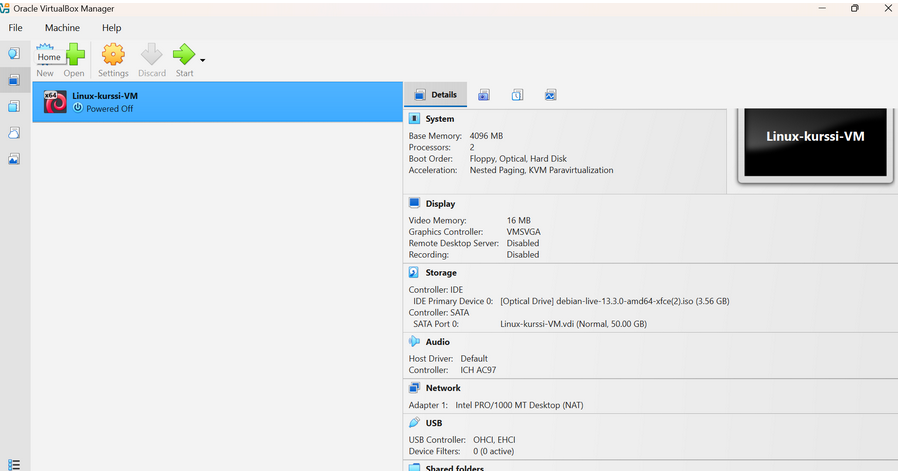
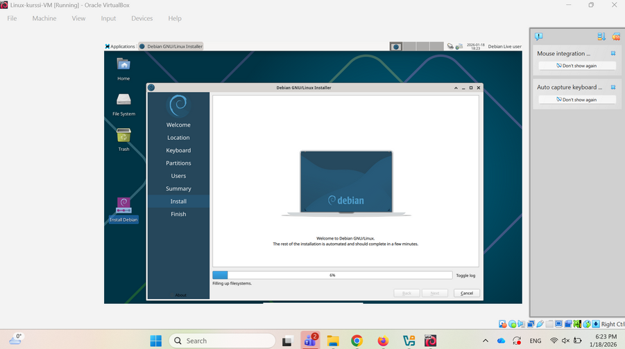
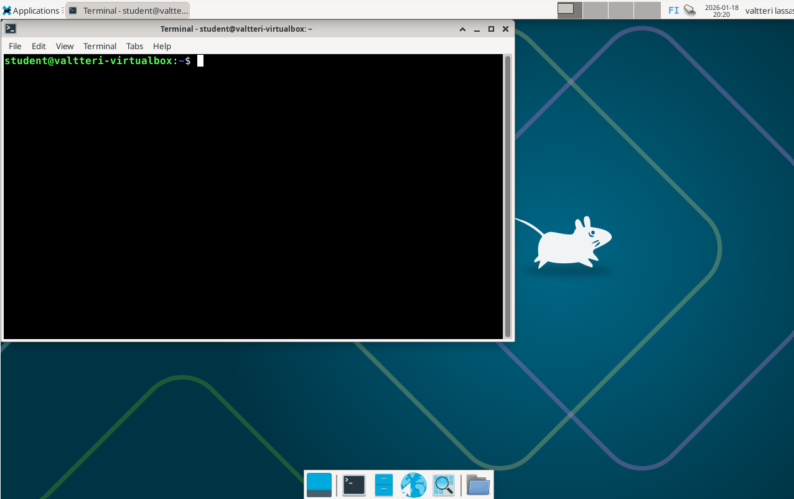

# Oma linux
## Asenna linux virtuaalikoneeseen
Asensin virtualboxmanagerin
Asensin virtuaali koneen ohjeiden mukaan
Lisäsin debian iso tiedoston debian sivustolta

menen debian installeriin ja täytän tiedot

asennus onnistui ja kirjaudun sisään
laitoin nämä komennot $ sudo apt-get update, $ sudo apt-get -y dist-upgrade, $ sudo apt-get -y install ufw, $ sudo ufw enable
Restartaan ja kaikki näyttää hyvältä

